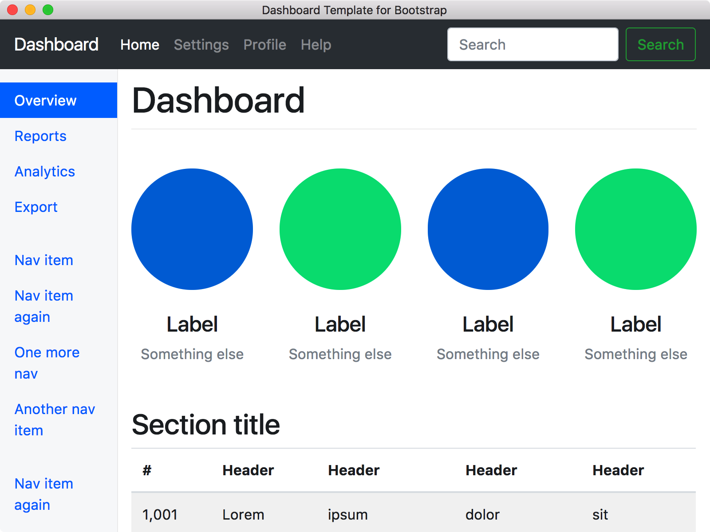
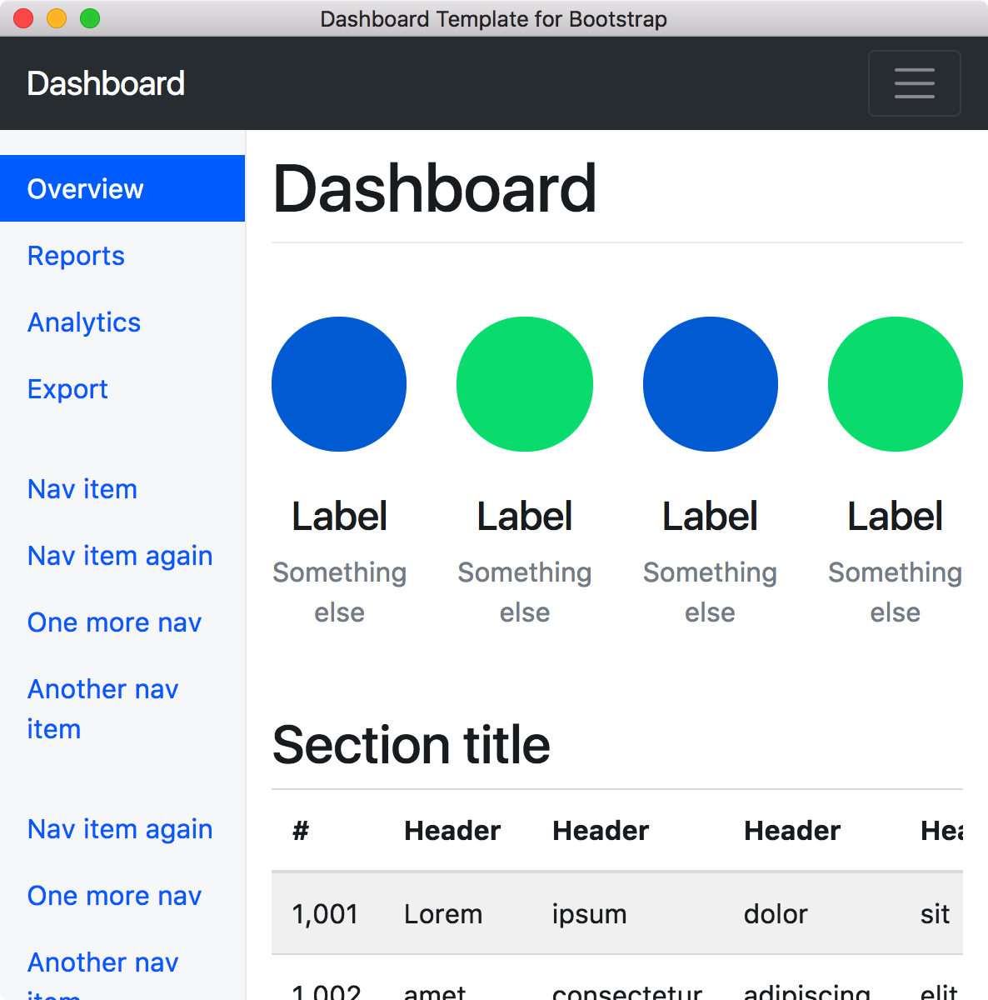
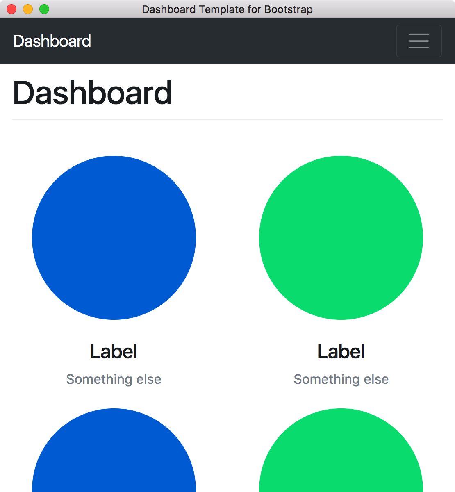

A Demonstration of How to Use Bootstrap and jQuery to Build an Electron Application
------------------------------------------------------------------------

What is Electron?

> If you can build a website, you can build a desktop app. Electron is a framework for creating native applications with web technologies like JavaScript, HTML, and CSS. It takes care of the hard parts so you can focus on the core of your application.

I built this demonstration application for those of you who have experience building web applications and are just getting started with Electron. I chose to implement Bootstrap 4.0.0-beta3 because:

> Bootstrap is the most popular HTML, CSS, and JS framework in the world for building responsive, mobile-first projects on the web

It happens to require jQuery which also comes in handy for web development. I borrowed the [Dashboard example markup](https://getbootstrap.com/docs/4.0/examples/dashboard/) from the Bootstrap project. As example markup its purpose is merely to demonstrate a responsive layout. The menu buttons demonstrate roll-over behavior but do not link to anything. The search box doesn't work. To the example for it's intended purpose grab the window frame and resize it. Watch the interface fold and unfold as it redesigns itself making the best use of the available space as the window goes from phone size to table size to desktop size.

Desktop
-------

Tablet
-------

Phone
-------

Quick Code Tour
---------------

 - The code entry point is in **package.json** under the key "main". The value is "main.js"
 - **main.js** creates a BrowserWindow and loads **index.html**. It also has event handlers that enable keyboard shortcuts for Developer Tools on various platforms. Note that loadURL uses a [template literal](https://developer.mozilla.org/en-US/docs/Web/JavaScript/Reference/Template_literals) to give the source file's location.`` `file://${__dirname}/app/index.html` ``
 - **index.html** loads Bootstrap's CSS in the &lt;head&gt; tag and **renderer.js** after the closing &lt;body&gt; tag. On the web Bootstrap's JavaScript would also load in this location but the Electron way is to load it in **renderer.js** with a require(). Note that these src and href attributes use normal relative paths. An HTTP server is not necessary.
 - **renderer.js** loads jQuery, Bootstrap and it's dependency; Tether. Each is assigned to the window object because this is the web application custom. It's not the Node.js or Electron custom because window is a global. For now we must do it this way or it won't work.

https://github.com/patrickmoffitt/bootstrap-example

https://www.highcharts.com/demo